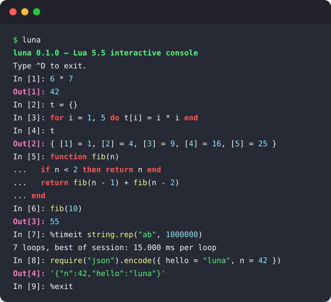

<p align="center">
  
</p>

<h1 align="center">luna</h1>

<p align="center">A batteries-included Lua runtime for scripting, tooling, and lightweight services</p>

<p align="center">
  <a href="https://github.com/cuihairu/luna/actions/workflows/cmake.yml"></a>
  <a href="https://github.com/cuihairu/luna/actions/workflows/daily-build.yml"></a>
  
  <a href="LICENSE"></a>
</p>

<p align="center">
  
</p>

## 定位

luna 是**开箱即用的 Lua 通用运行时**,服务三类场景:脚本(scripting)、开发工具(tooling)与轻量服务(lightweight services)。一个二进制里带齐 REPL、现代标准库、Node 式模块解析、目录插件与可选异步 I/O——*Lua with a REPL, batteries-included standard library, Node-style modules, plugins, package management and opt-in async I/O*。

Lua 生态里趁手的通用工具不多,每开一个新项目,周边设施都要先搭一遍。luna 想把这一层提前备好,把时间还给业务本身。

Node.js 只是**架构参考,不是产品身份**:luna 先是 Lua 运行时,再谈 Node 式体验——模块解析、标准库形状这些工程习惯对齐 Node,解释都在文档站[架构设计](https://cuihairu.github.io/luna/architecture)的对照表里;身份与内核仍是 Lua。

IPython 式的 REPL 是其中一件工具,不是全部。

## 三十秒

```bash
luna                     # 裸 REPL:查值、试库、拼代码片段
luna build.lua           # 跑一个脚本文件(构建/自动化/工具,像 lua)
luna -e 'require("http").serve(...)'   # 一行起一个轻量服务
```

接口服务一行也够,`^C` 即停:

```bash
luna -e 'require("http").serve(function(req, res)
  res:json({ hello = "luna", path = req.path }) end)'
```

TCP echo 同样一行(收一行回一行,`^C` 即停),另开终端 `echo hi | nc 127.0.0.1 9000` 即见 `echo: hi`:

```bash
luna -e 'require("net").serve("*", 9000, function(c)
  c:send("echo: " .. (c:receive("*l") or "") .. "\n") end)'
```

REPL 里 `6 * 7` 回答 `Out[1]: 42`,`%timeit` 随手测性能,`%whos` 看当前全部全局;细节见[CLI 与 REPL](https://cuihairu.github.io/luna/guide/cli-repl)。

## 获取

**一键安装**(装最新每日构建进 PATH,装完即验 `luna --version`,重跑即升级):

```bash
# Linux / macOS
curl -fsSL https://raw.githubusercontent.com/cuihairu/luna/main/install.sh | sh
```

```powershell
# Windows (PowerShell)
irm https://raw.githubusercontent.com/cuihairu/luna/main/install.ps1 | iex
```

产物是**滚动 nightly Release**(固定 tag [`nightly`](https://github.com/cuihairu/luna/releases/tag/nightly),每次绿跑清旧传新重发,附 sha256 侧车校验):公共仓库资产公开可下、**匿名直拉,不需要任何凭据**;脚本装完自验 `luna --version`。Actions artifact 只是每次 run 的本地副本,不作交付通道。当前产物矩阵:`linux-x86_64`、`linux-aarch64`、`macos-aarch64`(Windows 资产待源代码移植收尾后自动上线,见下)。

- **每日构建**:Actions 的 [Daily Build](https://github.com/cuihairu/luna/actions/workflows/daily-build.yml) 每天定时跑(UTC 01:23):Release 型构建 + 冒烟自检,发布滚动 nightly Release——纯产物流水线,全量测试由每次 push 的 CI 负责(夜间不把 rocks 组的网络腿带进每日窗口)。平台 zip `luna-nightly-<os>-<arch>`(内含二进制与 `luna_modules/` 模块侧车——二进制从自身同级目录解析 Lua 策略层)与 `.sha256` 侧车清旧传新;run 页 artifact(`pkg-<os>-<arch>` 3 天、汇总 `daily-build` 14 天)只是佐证副本。Windows 项为首飞试运行(源码的 Windows 移植未完,尚无产物),红不拖垮其余平台;macOS 项构建与产物已通,运行期测试按平台移植清单收敛中(见 todo)。生命线是 nightly Release,artifact 页与 Release 页互为佐证。
- **源码构建**:依赖只有 CMake ≥ 3.16 与 C 编译器,其余全部在 `deps/` 内:

```bash
cmake -S . -B build -DCMAKE_BUILD_TYPE=Debug
cmake --build build -j
ctest --test-dir build       # 全部测试组应全绿
```

macOS 需要 `brew install pkg-config autoconf cmake` 并 `export MACOSX_DEPLOYMENT_TARGET="10.6"`;可选 `libssl-dev` 启用 crypto 模块。详见[快速上手](https://cuihairu.github.io/luna/guide/getting-started)。

## 工具集

| 能力 | 说明 | 文档 |
| --- | --- | --- |
| REPL | replxx 行编辑、scintillua/LPeg 实时高亮、^C 中断、历史召回、`In[n]`/`Out[n]` | [CLI 与 REPL](https://cuihairu.github.io/luna/guide/cli-repl) |
| 魔法命令 | `%time` `%timeit` `%hist` `%whos` `%eval` `%load` `%reset` `%plugins` `%help` …,可插件注册 | [CLI 与 REPL](https://cuihairu.github.io/luna/guide/cli-repl) |
| 运行时内省 | `luna ps` 列出可 attach 进程(live/stale + 命令行);`%info` `%modules` `%stats` `%gc` `%globals` 探活本进程;`luna --attach <pid>` 远程同款 | [CLI 与 REPL](https://cuihairu.github.io/luna/guide/cli-repl) |
| 事件循环 | `loop`:定时器、TCP/Unix/TLS、异步 fs、信号、子进程;脚本尾部自动排水 | [事件循环](https://cuihairu.github.io/luna/guide/loop) |
| 一行起服 | `luna serve` 静态目录;`http.serve()` 静态/可编程;`net.serve()` TCP echo | [标准库 · http](https://cuihairu.github.io/luna/stdlib/http) |
| 模块 | 相对 require、`luna_modules/` 逐级上溯、`package.json` 式清单 `main`、`package.loaded` 缓存语义 | [模块系统](https://cuihairu.github.io/luna/guide/modules) |
| 标准库 | json/fs/net/http/csv/ini/toml/yaml/xml/zlib/crypto 绑定成熟 C 库或 LPeg;path/util/events/stream 纯 Lua 按 Node 语义;随二进制一体分发 | [标准库总览](https://cuihairu.github.io/luna/stdlib/) |
| 日志 | `logging`:六级阈值,console/文件/滚动文件/socket 等 log4j 式 appender(lualogging 1.8,随二进制) | [标准库 · logging](https://cuihairu.github.io/luna/stdlib/logging) |
| 插件 | `./plugins` → `~/.luna/plugins` → `$LUNA_PLUGIN_PATH`,manifest + 入口,失败隔离 | [插件开发](https://cuihairu.github.io/luna/guide/plugins) |
| 架构 | C 内核薄层 + 嵌入 Lua 策略层 + 扩展点;选型对比与事件循环 rationale | [架构设计](https://cuihairu.github.io/luna/architecture) |

## 文档

- 文档站:**https://cuihairu.github.io/luna** — 指南(快速上手 / CLI 与 REPL / 模块系统 / 插件开发 / 包管理 / 事件循环)、标准库逐模块参照、配置与环境变量、构建与自测、FAQ、架构设计;
- 源码在 [`docs/`](docs/),VitePress:`cd docs && pnpm install && pnpm run docs:dev` 本地预览。

## 开发

- 测试:ctest 十六组(luna / repl / cli / complete / introspect / highlight / magic / modules / plugins / serve / loop / rocks / line / linedit / main / covsum),改完跑 `ctest --test-dir build`;覆盖率用独立 Profiling 插桩树,见[构建与自测](https://cuihairu.github.io/luna/other/build);
- 推送 main 后 CI 自动构建并发布文档站到 Pages(部署不计为发布)。
